# Amaz☺n
## by Lisa
*A Shanzai website of Amazon for a totally different shopping experience*🛒🛍️😆


### Amaz☺n is a playful online space where you can discover laugh-out-loud products 😹that turn ordinary online shopping into a fun experience.

 Because we live in a busy world where everything seems to be complicated, even shopping online😿. The major trouble for shopping online is that it's hard for us to tell the quality of the products. Therefore, we always tend to read the customer reviews and spend more and more time evaluating our target products. However, in Amaz☺n, things become much more playful. You will find that no matter what you search, you will be lead to a page which is full of products that can bring small moments of joy to everyday life. **(Definitely gag gifts 🎁for your friends and silly little items 🤪for yourself!!!)** 

 

 Meanwhile, customer reviews are no longer used to evaluate products, but become small, warm, and amusing stories.

 

 The goal of this website is simple: to create a place where people can forget their stress and genuinely laugh for a moment.
 
 *Hope you enjoy it* (՞៸៸›⩊‹៸៸՞)🩷

 ---
 ## Design and Composition: Process

 I copied the structure and the content of the homepage of Amazon. Such as the navbar, the search bar, the recommendation parts and so on. Because I think it’s very important to make the website look real and similar to the original website to catch the attention of my viewers. However, there are some adjusted parts. For example, I found that only the ads of Amazon will change when you click on the arrow. To achieve this effect, I just simply copied the same page and only replaced the content of the ad. 

 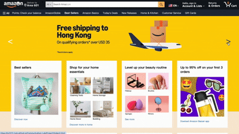

For the second page I copied the same structure of the 404 error page of amazon. I made two changes to the original page. One is that I changed the Amazon dog into an alpaca because I think when people see this animal, they will feel a sense of absurdity which matches with my concept. The other is that I made some words clickable on the page, and changed the font and color to make them obvious for my viewers to interact with.

On the laugh-out-loud picks page, I copied the same structure of Amazon’s products page. There is a side bar and some single units which contain the image, the description,customer rating and the price of the product. I also copied the clickable button but in different colors and sizes. However, I did make some adaptations to arouse the viewers’ interest. I changed all the long descriptions of the products into a single word with an emoji like “potato🥔”. I think in this way, people will be more willing to click on the button to know more about the product.

I divided the product’s introduction page into two parts the same as Amazon does. One reason is that the left part will stick to the top when you scroll down, while the right side just keeps moving down. Besides, looking from the content side, the left side is mainly about the pictures of the product, while the right side is the text. One of the changes I made is that I used a yellow background color to highlight the vital information of the product and when people hover their mouse over, text color will change. It becomes more attractive and interactive. Additionally, I use another hover trick in the customer reviews part. I found that people should click on the small pictures under the text review to see the picture clearly. To make it more convenient, I applied the scale function to the pictures. As long as people hover their mouse over the picture, they will view it in a much bigger size. 

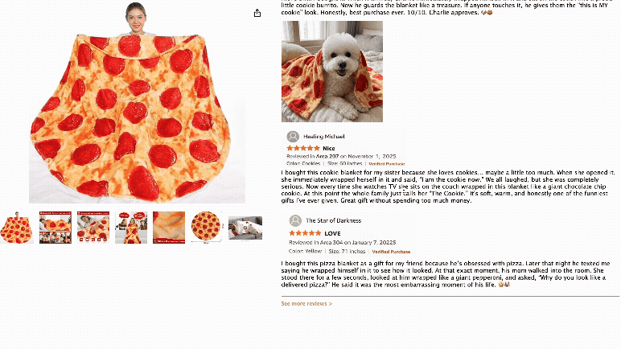

---

## Design and Composition: Gestalt Theory

I use **Similarity** and **Proximity** in designing the pages. For instance, the nav bars are all in blue colors, so they belong together. The white cards are in the same shape and structure, they also belong together.
Besides, I use **Continuity** mainly because people always naturally follow this principle.  For example, the laugh-out-loud products are arranged in visual continuity in both vertical and horizontal ways. People know where they should look at first, and scroll through the page to explore more.
The **Figure/Ground** principle helps me to emphasize the important parts of my website. For example, the ads lay behind the recommendation cards. I also choose to use a light color background to create contrast between the simple background and the colorful images.

---
## Design and Composition: Web Interactions

**Scrolling:** It is the basic element of my website. Because for a shopping website, people usually scroll their screen vertically, I only used the scrolling function to make my website look continuous and complete. 

**Hovering:** Amazon does not have much hovering, because almost everything is interactive which will lead customers to another page. In this case, I use lots of hovering to make my viewers realize which information they can interact with. For example, if the link is clickable, once the mouse approaches the link, it will change the original color.

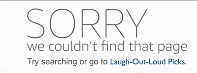

**Linking:** It serves like a bridge between each of the separate pages. It helps me to direct my audiences to the laugh-out-loud product page I want them to look at surprisingly. However, instead of using the most common form of link, I used some icons and images as links. I also remove the underline of the links to make them look better.

**Clicking:** Clicking on my website usually works together with linking. Somewhere, I made real button shapes to inform my viewer these are clickable. Once they  click them, they will be led to a totally new page. 

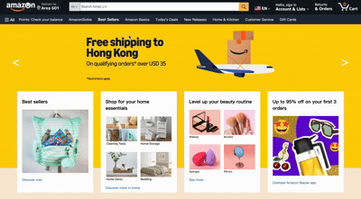

---

## Technical HTML

**Home Page**

It contains 6 main ```div``` boxes

- ```<div class="navBar1">```is responsible for  search bar. Inside this div box, there is an ```<div id=searchBar">``` containing three parts of the search bar - ```<class="searchDropdown">```,the left text part,```<class="searchInput">```, the middle input part, and ```<class="searchSubmit">```, the right img part.

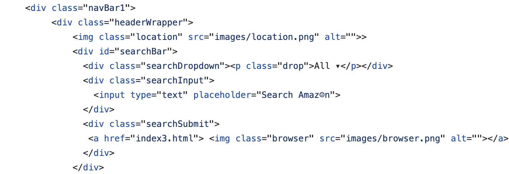
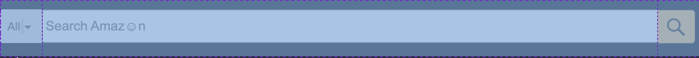

- ```<div class=navBar2">```  is responsible for the categories on the top. Inside it, there are several div boxes controlling each single text.

- ``` <div id="mainContainer">``` has ads ``` <div class="ads">``` and recommendation cards```<div class="cards">``` inside.
All the cards share the same strucrure. Each of them is consist of a white background``` <div class="singleCardWrapper">```, a header such as ```<h3>Shop for your home essentials</h3>```, an image such as ``````, and a link ```<a class="discover" href="index3.html">Discover more in home</a>```

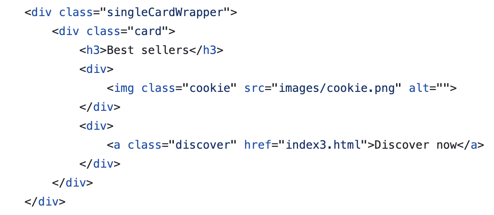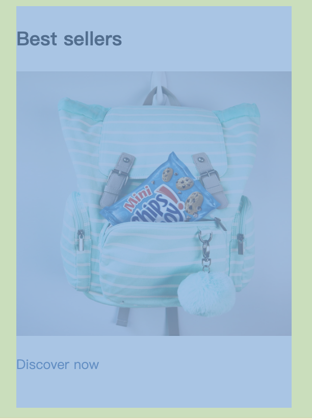


- ```<div class="long">``` is responsible for the other two wide cards behind the eights recommendation cards.

- ```<div class="back">``` is a box for a link ```<a class=top href="index.html">Back to top</a>``` to back to the top of the page.

- ```<div class="bottom">``` is a copying version of the amazon's bottom part. It contains four ```<div class="smallBottom">```

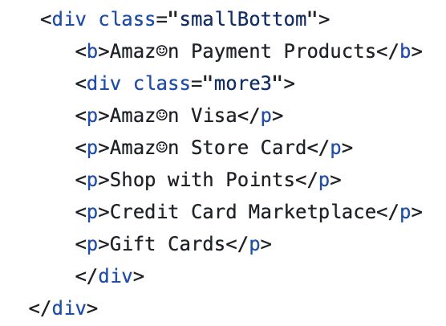
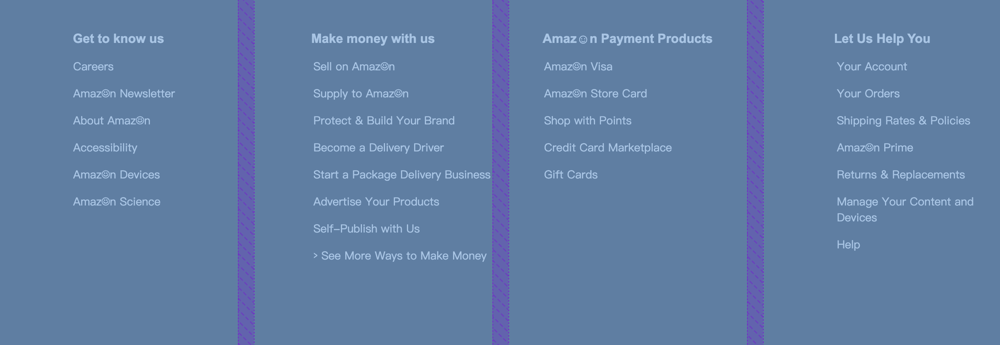

**404 Page**

The top search bar and the bottom part are the same as the homepage.
The unique part is in the middle```<div class="notfound">```which contains a link to the next page as well as an image of the alpaca 

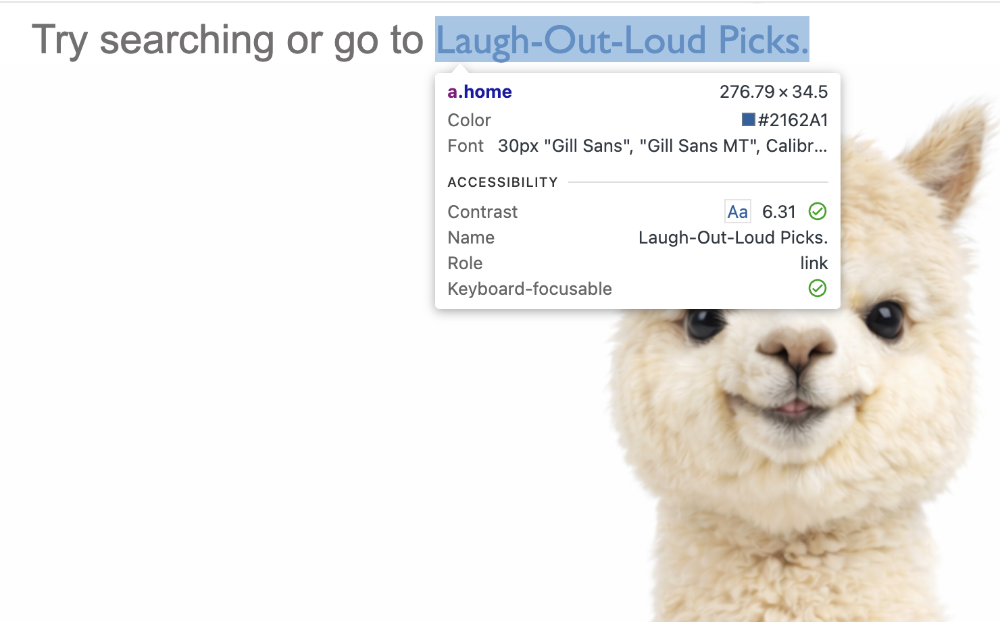

**Laugh-out-loud Picks Page**

Its top also shares the same structure as the previous pages. The main body is ```<div class="mainbox">``` which contains ```<div class="sideBar">```, a side bar on the left, and ```<div class="hi">```, a collection of all the laugh-out-loud products on the right.

In ```<div class="hi">```, I made two versions of the product page, one is clickable, the other is unclickable.
- The clickable one is named ```<div class="box">```with both an clickable image and a link.

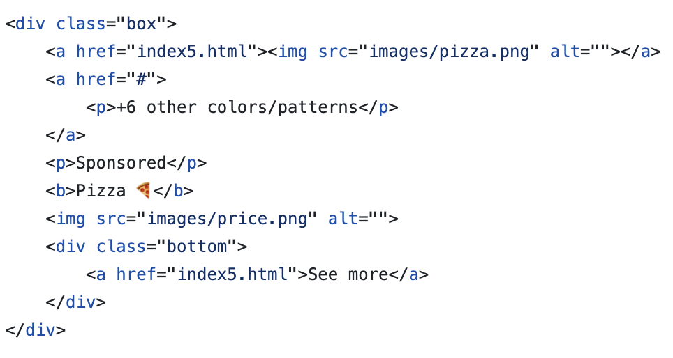

- The unclickable one is named ```<div class="boxNot">``` with everything is unclickable inside.

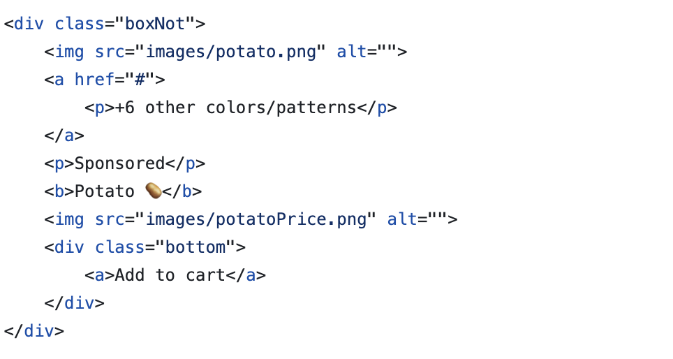

But they are looked pretty much the same visually.

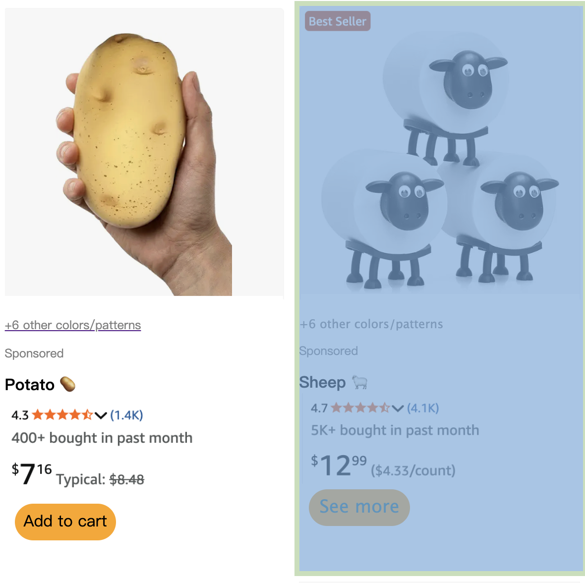

**Product Introduction Page**
Because I made three clickable boxes on laugh-out-loud picks page, they all share the same structure.
I divided the page into two boxes.
- ```<div class="picture">``` on the left is consist of two different sizes of images of the product. One big size in ``````and seven small size in ```<div class="small">```
They don't co-move with the other box.

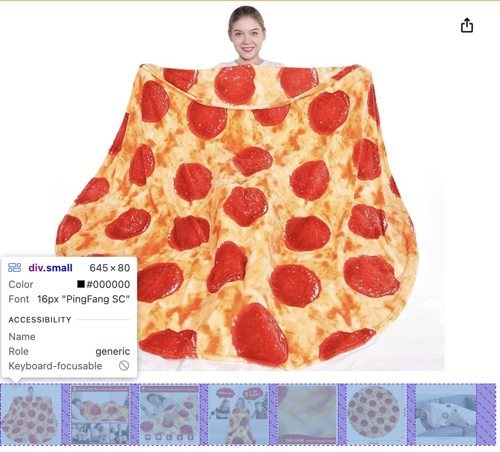

- The ```<div class="introduction">``` on the right will keep moving down as scrolling down the page. It consists of ```<div class="header">```, the eye-catching description of the product, ```<div class="about">```, the detailed introduction, ```<div class="about">```, customer rating, and ```<div class="comment">```, some warm and interesting stories between people and the product.

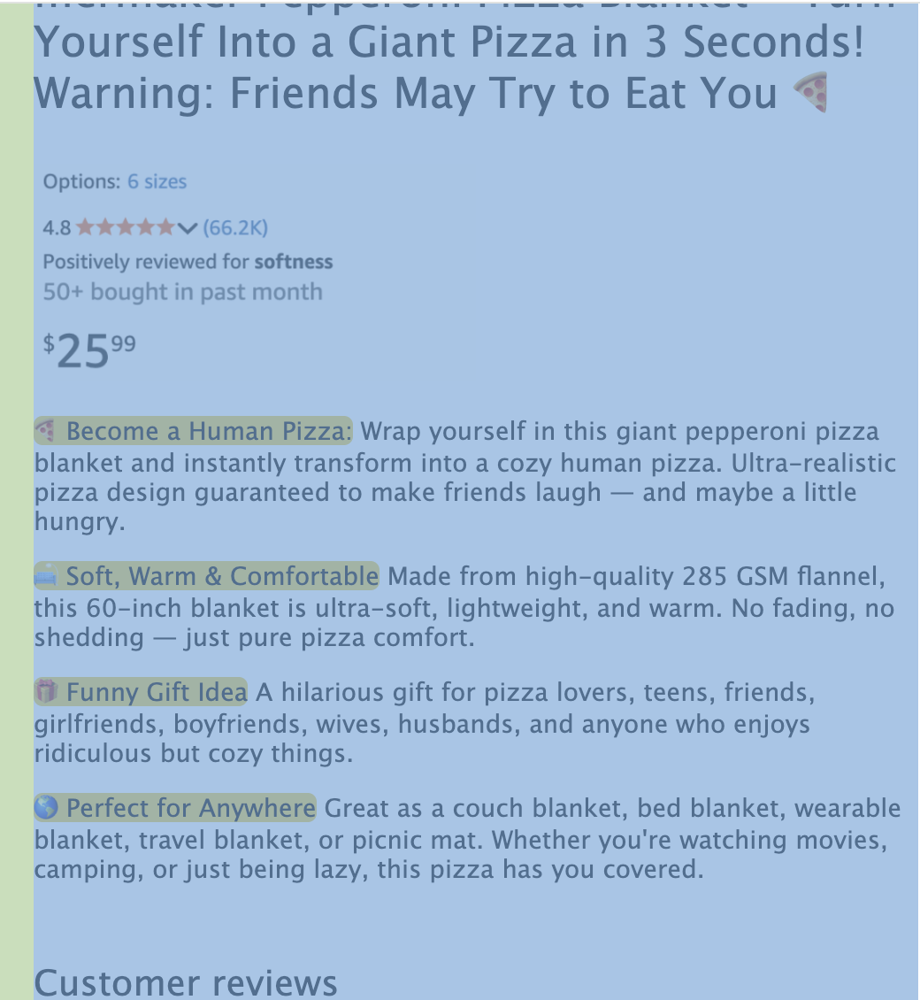


