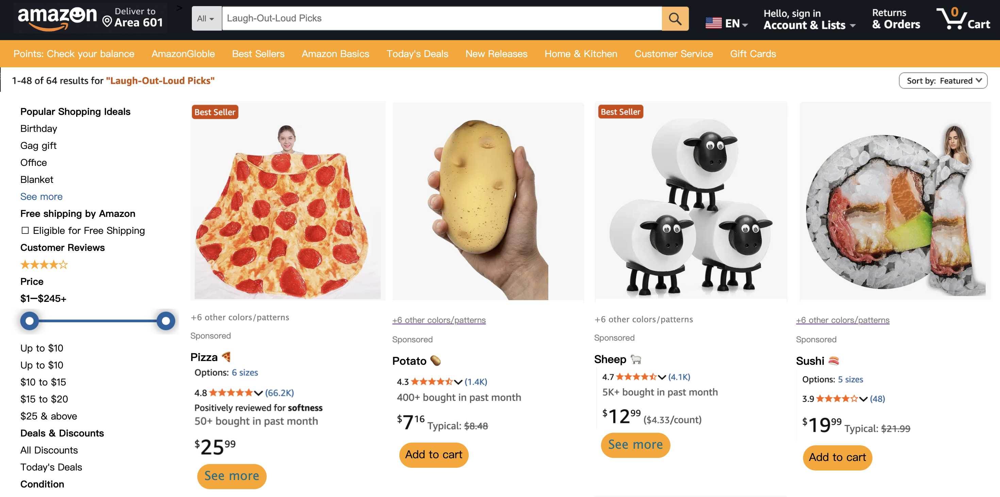
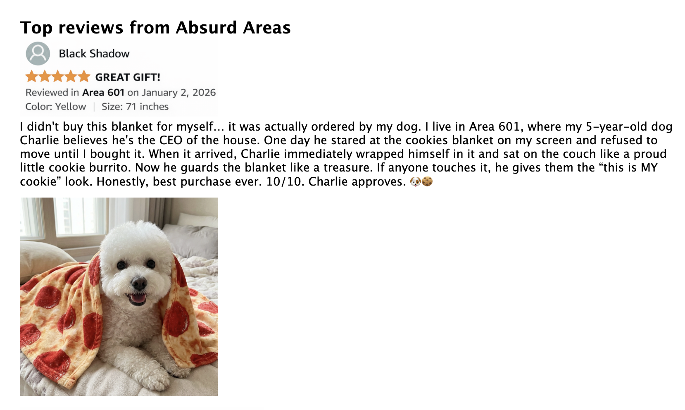

# Amaz☺n
## by Lisa
*A Shanzai website of Amazon for a totally different shopping experience*🛒🛍️😆

### Amaz☺n is a playful online space where you can discover laugh-out-loud products 😹that turn ordinary online shopping into a fun experience.

 Because we live in a busy world where everything seems to be complicated, even shopping online😿. The major trouble for shopping online is that it's hard for us to tell the quality of the products. Therefore, we always tend to read the customer reviews and spend more and more time evaluating our target products. However, in Amaz☺n, things become much more playful. You will find that no matter what you search, you will be lead to a page which is full of products that can bring small moments of joy to everyday life. **(Definitely gag gifts 🎁for your friends and silly little items 🤪for yourself!!!)** 

 

 Meanwhile, customer reviews are no longer used to evaluate products, but become small, warm, and amusing stories.

 

 The goal of this website is simple: to create a place where people can forget their stress and genuinely laugh for a moment.
 
 *Hope you enjoy it* (՞៸៸›⩊‹៸៸՞)🩷

 ---
 ## Process: Design and Composition

 I copied the structure and the content of the homepage of Amazon. Such as the navbar, the search bar, the recommendation parts and so on. Because I think it’s very important to make the website look real and similar to the original website to catch the attention of my viewers. However, there are some adjusted parts. For example, I found that only the ads of Amazon will change when you click on the arrow. To achieve this effect, I just simply copied the same page and only replaced the content of the ad. 

For the second page I copied the same structure of the 404 error page of amazon. I made two changes to the original page. One is that I changed the Amazon dog into an alpaca because I think when people see this animal, they will feel a sense of absurdity which matches with my concept. The other is that I made some words clickable on the page, and changed the font and color to make them obvious for my viewers to interact with.

On the laugh-out-loud picks page, I copied the same structure of Amazon’s products page. There is a side bar and some single units which contain the image, the description,customer rating and the price of the product. I also copied the clickable button but in different colors and sizes. However, I did make some adaptations to arouse the viewers’ interest. I changed all the long descriptions of the products into a single word with an emoji like “potato🥔”. I think in this way, people will be more willing to click on the button to know more about the product.

I divided the product’s introduction page into two parts the same as Amazon does. One reason is that the left part will stick to the top when you scroll down, while the right side just keeps moving down. Besides, looking from the content side, the left side is mainly about the pictures of the product, while the right side is the text. One of the changes I made is that I used a yellow background color to highlight the vital information of the product and when people hover their mouse over, text color will change. It becomes more attractive and interactive. Additionally, I use another hover trick in the customer reviews part. I found that people should click on the small pictures under the text review to see the picture clearly. To make it more convenient, I applied the scale function to the pictures. As long as people hover their mouse over the picture, they will view it in a much bigger size. 

