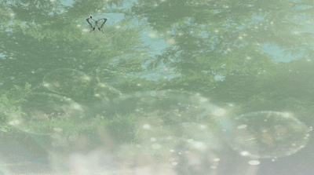

# Shall I Compare You to a Summer's Day
## by Lisa
*A website where, by moving through the heat and fleeting rush of summer, the beauty of a summer’s day slowly and quietly unfolds.*

This project is an interactive website which brings the intangible feelings of summer to life through a gentle visual experience. By moving through its heat, haste, and fleeting moments, visitors gradually rediscover the beauty of a summer’s day.

## Abstract
The website is adapted from the poem with the same name by William Shakespeare. The poet compares people to a summer’s day, but he presents the poem in a different way. He leads viewers to go through the downsides of summer first, and then turns his tone to praising summer’s beauty. It feels as if people are like summer days; you need to be patient and spend time discovering the beauty in yourself as well as in the people around you.

Because the original work is a poem, people can only see the text, which can sometimes feel abstract and difficult to understand. I keep some parts of the text and add more visualized elements to turn the reading experience into a more engaging experience.

The key idea guiding my version is not to build one hundred percent on the original, but to follow the inspiration I got from the poet and add my own feelings about summer, such as how to present the heat of summer, how to let people feel the shortness of summer, and where the beauty of summer exists in our daily life.

