# Shall I Compare You to a Summer's Day
## by Lisa
*A website where, by moving through the heat and fleeting rush of summer, the beauty of a summer’s day slowly and quietly unfolds.*

(･ω<)☆

This project is an interactive website which brings the intangible feelings of summer to life through a gentle visual experience. By moving through its heat, haste, and fleeting moments, visitors gradually rediscover the beauty of a summer’s day.

## Abstract
The website is adapted from the poem with the same name by William Shakespeare. The poet compares people to a summer’s day, but he presents the poem in a different way. He leads viewers to go through the downsides of summer first, and then turns his tone to praising summer’s beauty. It feels as if people are like summer days; you need to be patient and spend time discovering the beauty in yourself as well as in the people around you.

Because the original work is a poem, people can only see the text, which can sometimes feel abstract and difficult to understand. I keep some parts of the text and add more visualized elements to turn the reading experience into a more engaging experience.

The key idea guiding my version is not to build one hundred percent on the original, but to follow the inspiration I got from the poet and add my own feelings about summer, such as how to present the heat of summer, how to let people feel the shortness of summer, and where the beauty of summer exists in our daily life.

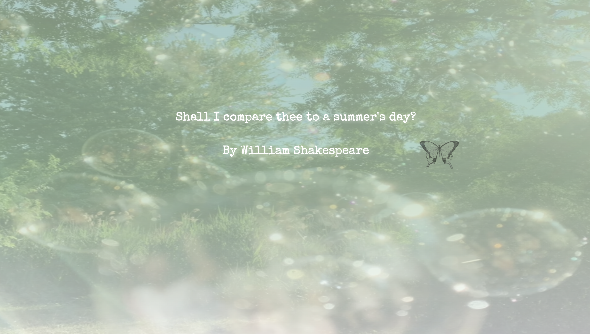
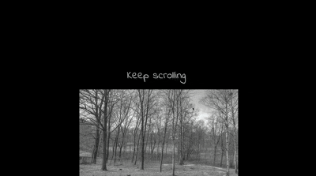
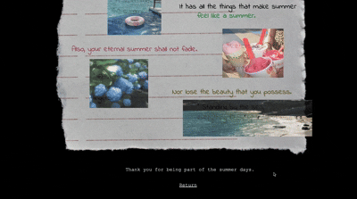

---
 ## Design and Composition: Process
 ### My Source 

 My inspiration came from a poem named *Shall I Compare Thee to a Summer’s Day?* By William Shakespeare. Here is the original poem. (Because it was written in the old English language, I find the modern English version translation online)

 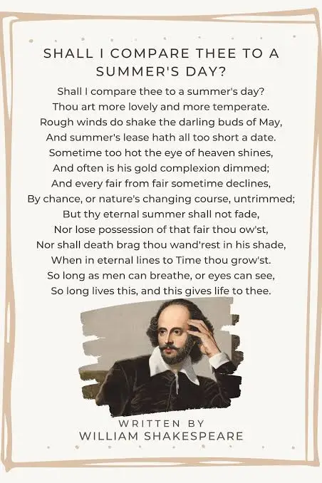

 ### The Parts I Choose to Translate 

Because the central idea of this poem is to **compare a person to summer**, I focused on this aspect in my adaptation. Instead of directly telling viewers the reasons for this comparison, I begin by presenting the downsides of summer. As the original version suggests, sometimes summer is too hot, and sometimes it is too short. I tried to visualize these feelings beyond the abstract text.

In this part, I keep some of the original lines as subtitles to help viewers understand, such as *“Rough winds shake the beloved buds of May, and summer is far too short”* and *“Everything beautiful eventually fades,By chance or nature’s changing course”* At the same time, I add my own reflections as subtitles, such as *“No summer stays where the days continue to turn.”* I intentionally avoid indicating which lines are original and which are my adaptation by not adding quotation marks to the original text.

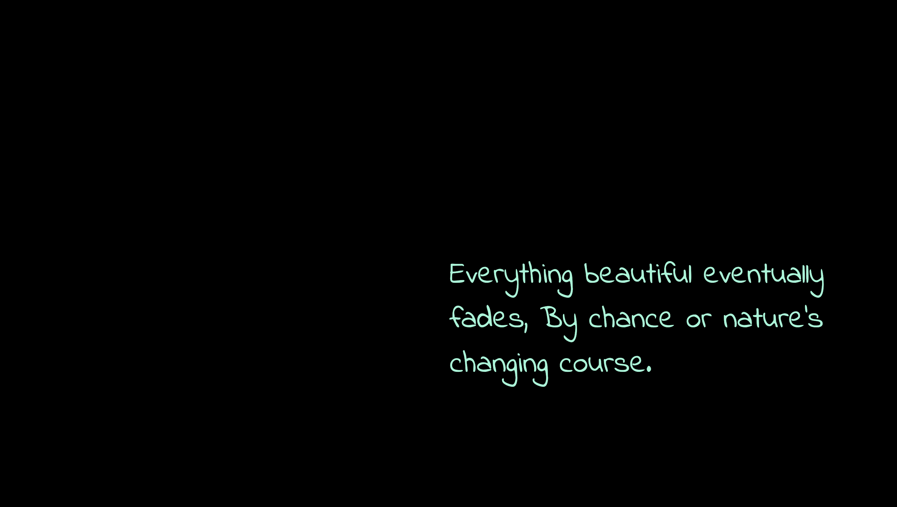
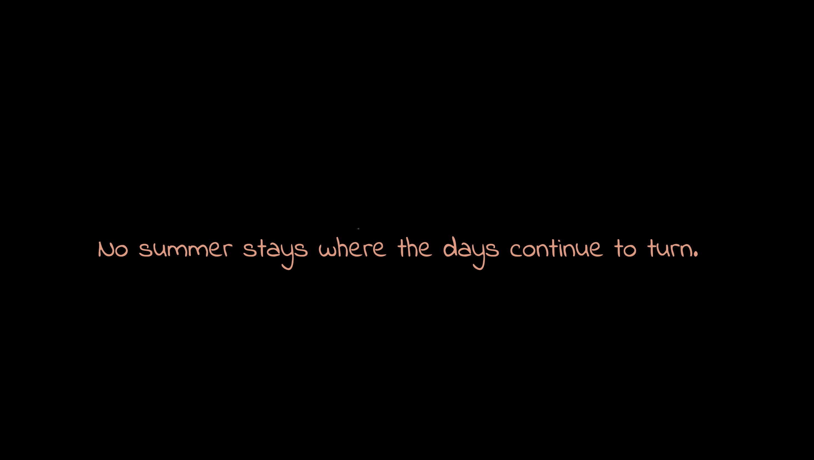

Another major change is the transition from the downsides of summer to its beauty, which reflects more of my personal interpretation. The poem suggests that beautiful things will eventually fade as time passes. However, I reinterpret this idea by suggesting that the beauty of one’s inner summer does not fade as long as one can breathe and see. I transform this profound ending into a simpler and more understandable version.
I use familiar and common objects to help viewers recall their own sweet memories, allowing them to feel that the beauty of summer exists in every small, even unnoticeable moment. Although summer is hot and short, it still has its own beauty, just like you and me. 🍦🍉🎇

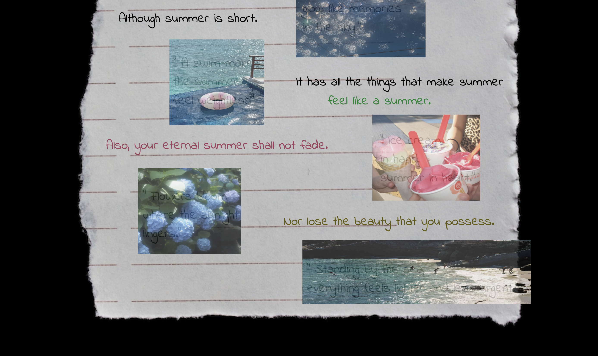

Additionally, I rearranged the order of the poem and removed some parts to better match my narrative logic.

### Shaping Narrative Through Browser Affordances

**Scrolling:**
Scrolling is the primary interaction used in my website. As viewers scroll down, they gradually move through the poem. I chose this interaction because scrolling allows people to sense the passage of time. Since I want viewers to be aware of time throughout the experience, scrolling felt like a natural choice.
In the section that represents the change of seasons, scrolling helps convey how quickly a year passes. Time moves linearly. It only goes forward and never turns back, so I speed up the visual changes without altering other elements.
However, viewers can always scroll back up to revisit any part they wish to explore further. When they move forward again, they might have a different feeling from before.

**Clicking:**
I consider clicking as an interaction that usually introduces new elements to a page. However, I was concerned that using too much clicking might disrupt the gentleness and consistency of the overall narrative. As a result, clicking in my website functions more as a trigger to begin or transition between sections.

Instead of adding a simple button labeled *“click to continue,”* I place poetic and descriptive hints beside each clickable element. For example, at the very beginning, I designed a moving butterfly as a clickable button. I chose a butterfly because it naturally fits the atmosphere of summer and its ability to fly aligns well with the animation I wanted to create. Since the opening scene only shows the background and the flying butterfly, viewers might feel unsure about what to do next. I therefore added the hint, *“catch the butterfly and begin your summer days.”* This line suggests that viewers are not just observers, but participants in the experience.

Another clickable element is a link that leads to the ending section. My concept consists of two contrasting parts, moving from disliking summer to embracing it. If these parts appeared on the same page, the transition might feel confusing. Therefore, I embedded a link within the text that highlights the uniqueness of summer, guiding viewers from the negative aspects toward the beauty of summer in a clearer and more intentional way.

**Sound:**
I use two types of audio in my project. One is the typing sound, and the other is the sound of summer days. The typing sound enhances the realism of the typing effect and helps viewers feel more immersed as the text appears word by word. The sound of summer days, including birds and cicadas, further deepens this immersion and reinforces the feeling that the entire webpage is centered around summer.

However, because I cannot predict how long viewers will take to go through the webpage, the summer sound plays only once and then stops automatically.

### Choices in Structure, Interaction and Sequence
I use a parallel structure and it is associated with my scrolling interaction. 
Sequence matters on my website because I want viewers to experience the downsides of summer first. This is where my version differs most from the original poem. The original poem begins with *“Shall I compare you to a summer’s day? You are more lovely and more gentle,”* which may cause confusion for viewers. They might wonder why this comparison is made, what the characteristics of summer are, and why a person is described as more lovely and gentle.

Therefore, I choose to present summer itself to the viewers first, and only later connect it to people. While the original poem directly states the comparison, my approach allows viewers to feel and understand summer before gradually realizing the reasons behind the comparison.

### Gestalt Theory and Medium-awareness
**Similarity:** I use the same style of design throughout the whole website. Such as using green to represent summer and using hand written font to make it look more artistic and poetic. 

**Continuity:** The scrolling interaction guides the viewer’s eye naturally downward, creating a clear and intuitive visual path to follow. As the text appears one by one with gentle fade-in and fade-out transitions, the movement feels smooth and uninterrupted.

**Closure:** I apply the closure principle in the part where I design the wheel of a year. Although only summer is visually presented through images, the remaining seasons are intentionally left blank and invisible. Viewers naturally complete the missing parts in their minds, perceiving the circle as a full representation of all four seasons. This absence guides attention toward summer while still allowing the whole year to be understood through imagination.

**Figure ground:** I avoided using fancy colors or background images, so the contrast naturally directs viewers’ attention to the foreground content. I also increase the brightness of the text in white to make them more readable.

**“Medium is the message”** makes me think about the difference between poetry and a website as two very different mediums. Poetry has a long history. In poems, writers rely on carefully chosen words and sentence structures to express subtle feelings. Readers stay outside the work, and each person may understand it in a different way. This also shows a limitation of poetry. Poets often do not know whether readers truly understand what they mean. Some metaphors may feel too abstract, and some lines may only make sense to certain people.

When I think about the web as a newer medium, I feel that some of these limitations can be reduced. On a website, I can design the structure and interactions to guide viewers through a particular experience and help them feel what I want them to feel. Viewers are no longer just reading from the outside. They move through the story and become part of the journey.

A website also allows me to involve more senses, which makes the experience more immersive and dynamic. For example, instead of directly saying *“summer is hot,”* I use blur effects, scrolling, and changes in position and size to let viewers feel the heat and discomfort in a more intuitive way.

---

## Technical HTML

**Start Page**

It contains 4 parallel```div``` boxes.

```<div class="open">``` is responsible for the background image.

```<div class="next">``` is the div for the clickable button which link to second page. 

```<div class="hint1">``` and ```<div class="hint2">```are both the instructions, Because I want them in the center and want to control the space between each line, I divide them into two lines.

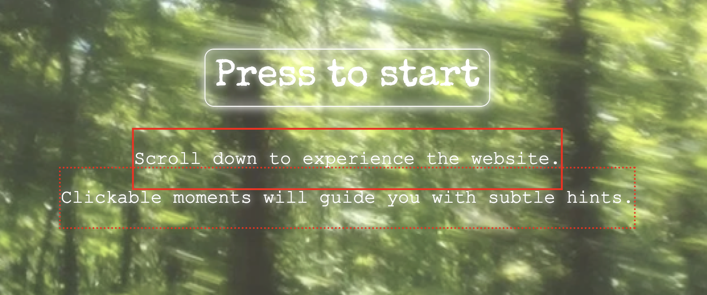
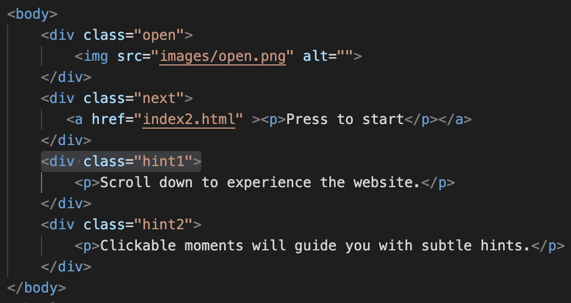

**Main Page**

It contains 6 big ```div```

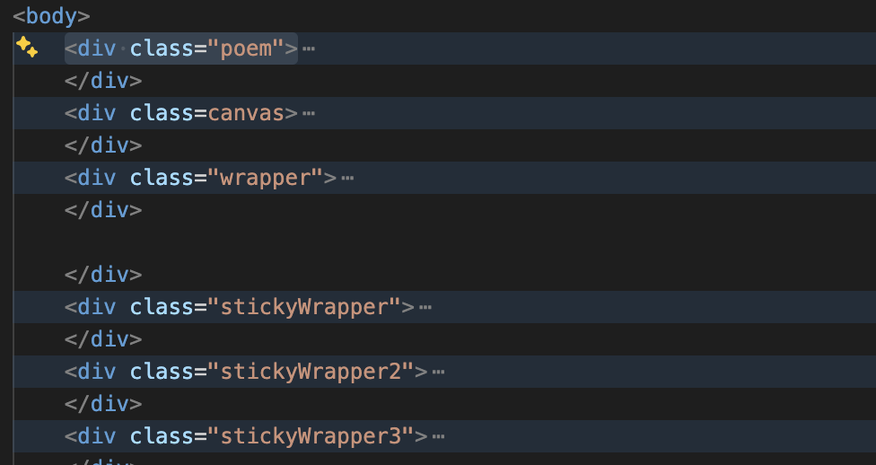

```<div class="poem">``` contains all the orignal texts and my adaptations. It moves and changes with scrolling and will not be affected by other sections' interactions.

```<div class=canvas>``` contains the introduction section and the heat section.

- For introduction section:

```<div class="reference">``` has ```<p class="shall">```and```<p class="Shakespeare">``` for the typing text.

```<div class="move">``` is a div which only responsible for the moving butterfly.

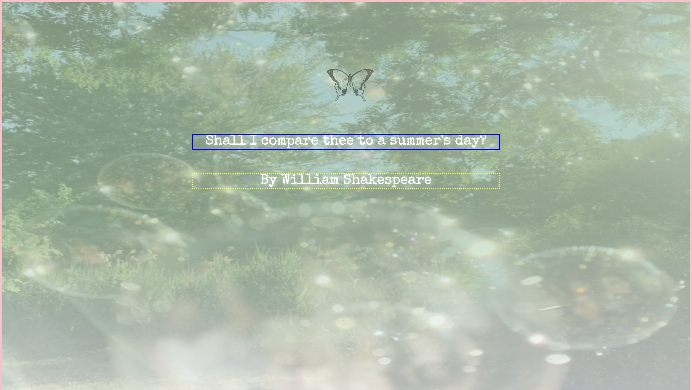
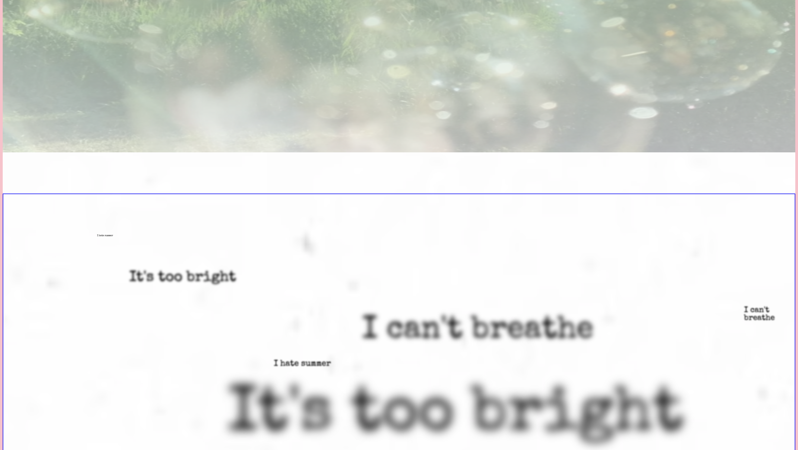

- For heat section:

There are multiple ```<p class="heatP">``` inside ```<div class="heat">``` because I want to manipulate text inside.

Besides, there are two audio inside, which I can also put them in ```<div class="move">```, because they are controlled by the clickable butterfly.

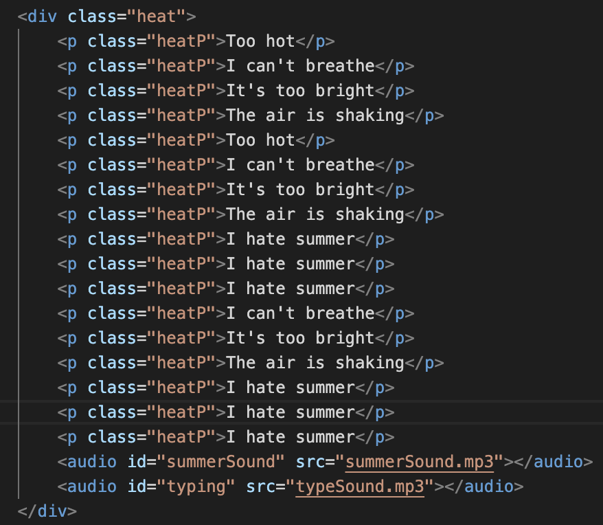

```<div class="wrapper">``` is all about the wheel section.

- For wheel section 

```<div class="summer">```,```<div class="black1">```and```<div class="black2">``` are in the same hierachy.

```<div class="summer">``` has the image of the wheel of seasons inside. While ```<div class="black1">```and```<div class="black2">``` are just the black boxes to hide the additional parts of the wheel during the rotating interaction.

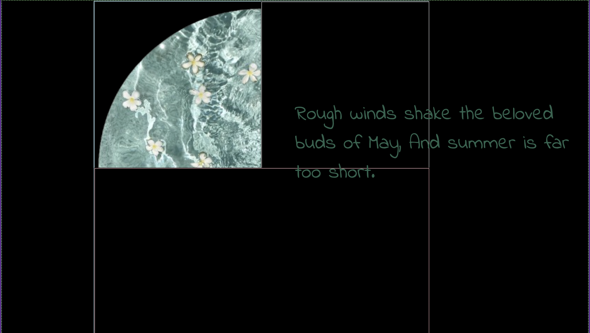

- For seasons changing section

```<div class="stickyWrapper">```, ``` <div class="stickyWrapper2">``` and ``` <div class="stickyWrapper3">``` are in the same hierachy and the same inner structure.

Each of them has a ```<div class="gifWrapper">``` inside which contains the images.

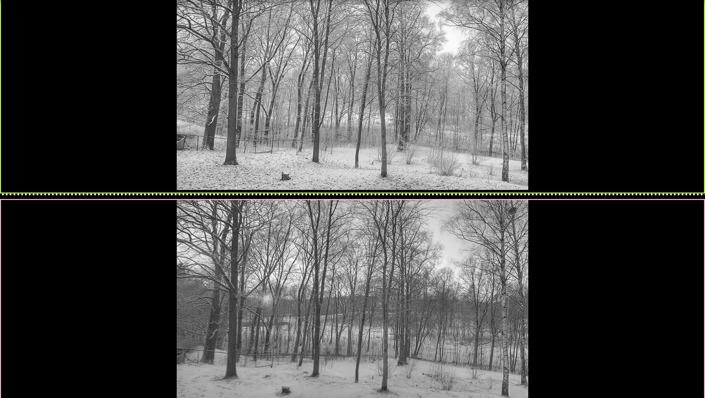
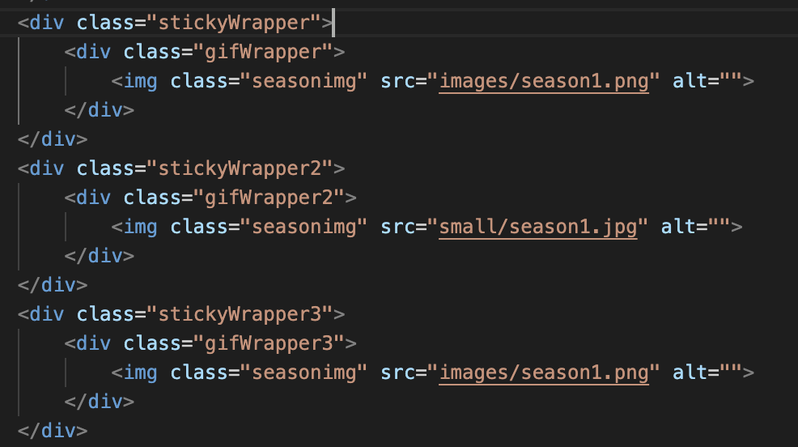

**Ending Page**

There is one big div ```<div class="sticker">```

Inside the big div, there are six small div containing different images in different size. (Such as ```<div class="firework">``` and ```<div class="icecream">```)

There is an addtional div called ```<div class="paper">```. It is responsible for the background amd ```<p>``` right above the background.

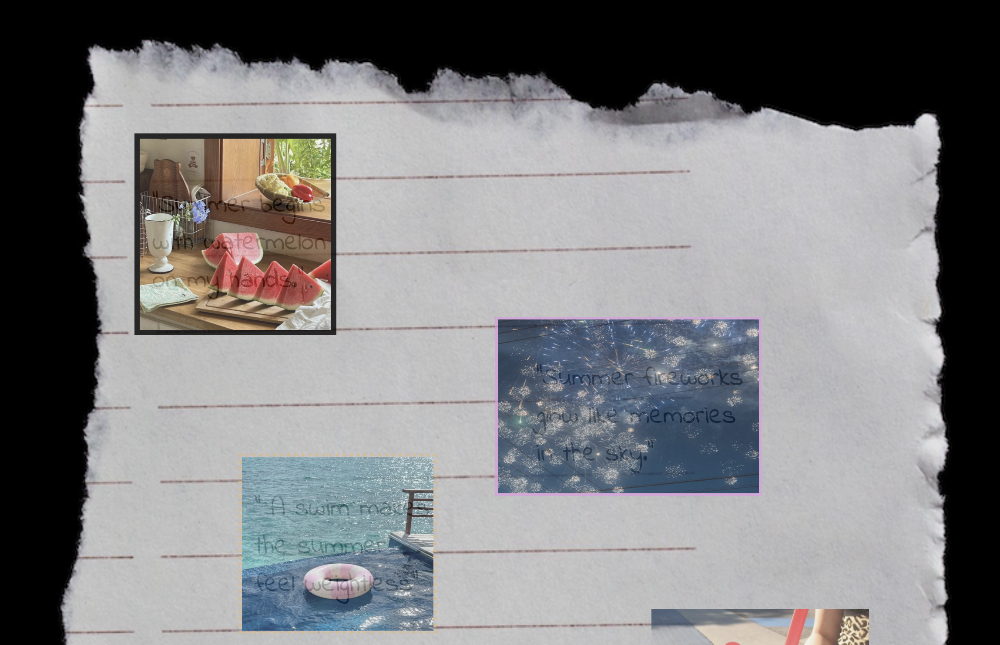

---
## Technical CSS

### Summary of the key CSS decisions

- I created a butterfly flying animation which simulates the natural movement of a butterfly. This not only adds liveliness to the page but also reinforces the thematic connection to summer and nature.

- I also applied a typing animation to simulate a typewriter effect. The slight delay rhythm makes the text feel more human and emotionally expressive, rather than appearing instantly on the screen.

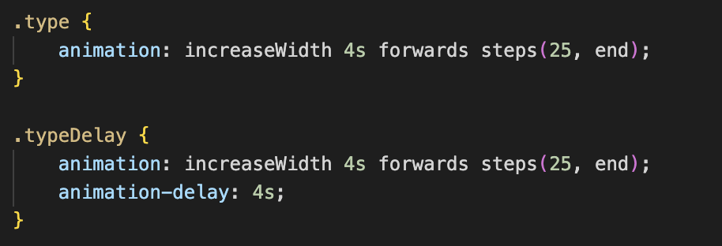
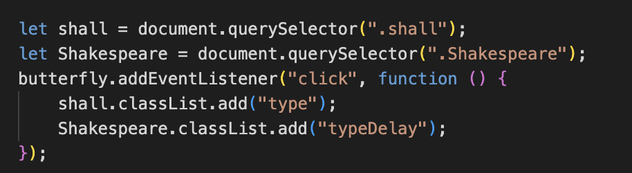

- To support user interaction, I made each section stick to the top of the screen until the interaction is completed. This prevents users from scrolling past important interactive moments and encourages them to engage more intentionally with the content.

- Additionally, I designed hover effects that trigger different interactions when users move their cursor over certain elements.

- I also add fade-in and fade-out transitions for text and visual elements. This helps the content appear more harmonious and ensures smoother visual flow between sections.

### The significant interactive element:

It’s very cool to see how the image change frequency speeds up as you scroll. The image sources I use are a series of photos taken at the same place but in different seasons. I use this interaction to convey the idea that summer exists for only a quarter of the year and to visualize the feeling of time passing faster and faster.

**In JavaScript:**

I developed this with the professor’s help. We used the function we learned in class to calculate the percentage of the window that has been scrolled. Then, by using console.log, we identified the start and end percentages of each interval. We calculated the performance length by subtracting the start percentage from the end percentage.

We convert the window’s scroll percentage into an animation percentage because we need ```animationPercentage``` to normalize the scroll range into a 0–1 progress value, so it can be accurately mapped to the image frame sequence.

For the image section, I have 10 images in total. By dividing them into equal intervals, they appear at the same frequency. In addition, because image numbers must be integers, we use the ```Math.floor``` function to ensure smooth transitions between frames.

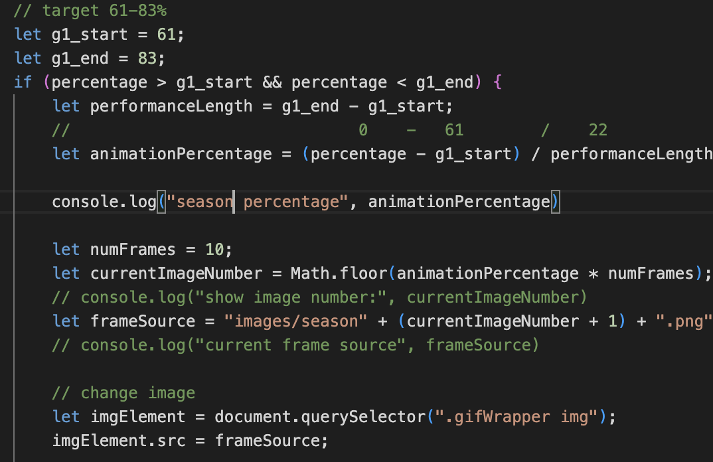

**In CSS:**
For each wrapper div, I give them different height. A high div will slow down the speed, while a short div will speed up the movement. The gifWrapper div is sticky to the main wrapper fo better interaction experience.

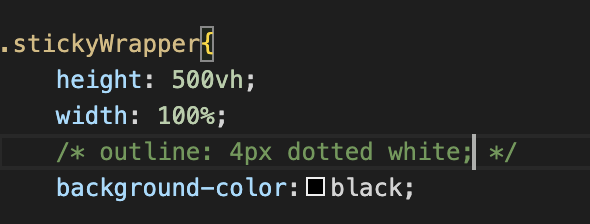
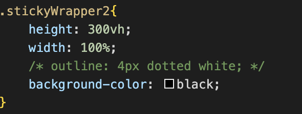
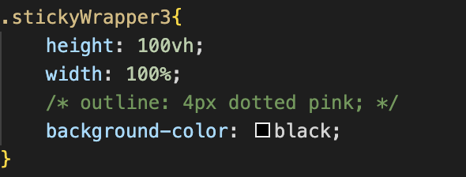
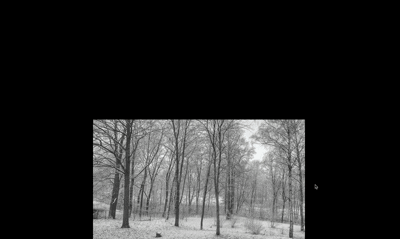

---
## Reflection

### Changes from Initial Idea to Final Version

My initial idea was just presenting the original text in different versions, such as using different languages and adding different effects to the texts. However, I gradually realized that this does not make sense because I am supposed to use websites as a medium to reconstruct and reinterpret the poem, instead of presenting it directly. I should let viewers get the point of summer not through text, but through the experience and their feeling when they go through the website.  Therefore, I changed my point of view, shifting my attention to how to make people feel the characteristics of summer that are described in the poem, and how to turn these abstract and intangible feelings to something real and understandable.

### Telling Stories in the Medium of the Web

First, I realized that the web offers far more possibilities than many traditional mediums. It can combine multiple sensations, such as visuals, sound, movement, and interaction, into one unified experience.

Second, the web allows interactions to become unexpected triggers, almost like a game. Each action a viewer takes can lead to a different process or outcome. Compared with mediums such as film or books, this creates a stronger sense of surprise and unpredictability。

Finally, I learned that storytelling on the web can be both narrative and interactive at the same time. Instead of presenting a story in a one-way direction, the web allows viewers to participate in the storytelling process through their actions.

### Successful Part

One part I consider successful is the blurry text section. I used the  percentage fiction to make the text gradually blur and then return to clarity as viewers scroll. At the same time, viewers can hover over each single text to move it to a new position. Following my professor’s suggestion, I made the text container stick to the top and added a white background with black dots. This helps viewers realize that they can continue scrolling to the next part while still interacting with the text.

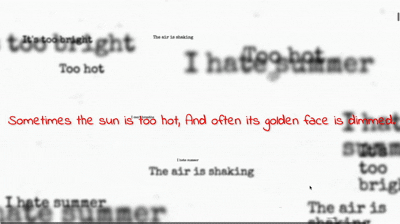

### Part that I Want to Improve 

The first area I would like to improve is the wheel of seasons section. My initial method for showing only one quarter of the rotating wheel was to use a black block to cover the rest. However, because the image I used is not perfectly symmetrical, it was difficult to center it and align it precisely with the black block. I had to manually adjust the position using percentages. While this looks fine on my own screen, the layout breaks on screens of different sizes.

I also want to add background images to strengthen the feeling of summer in this section. To do that, I will need a different way to hide the rest of the wheel instead of relying on the black block method.

 The second improvement relates to the speeding up of the seasonal changes. I want viewers to feel how briefly summer exists within a year. During office hours, my professor and I tried controlling this by placing images in different divs and adjusting the height of each section. By mapping image changes to the scroll percentage between a start and end point, a taller section (for example, 500vh) creates a slower transition, while a shorter one (around 10vh) makes the change feel faster. However, this approach creates a limitation. Because each section has its own height and image sequence, the website ends up displaying multiple combinations of images depending on how many sections are created. What I really hope to achieve is a single continuous image sequence that plays only once from beginning to end, while gradually accelerating as the viewer scrolls.

### Part that I Want to Expand

 I would like to add more interactive elements to the ending section, as it represents an important turning point in the narrative. Instead of relying mainly on text, I want to replace parts of it with interactions. I want to make the typical yet familiar summer elements clickable. For example, clicking on a firework could make it bloom in the sky, and clicking on an ice cream could allow viewers to type in their favorite flavor. In this way, viewers would experience the beauty of summer more vividly through interaction, rather than only reading about it.
  
### Feedback from Peers and Instructors

- Interaction day: 

I received feedback that some of my text appeared too suddenly. As a result, I added fade-in and fade-out effects to make the appearance of the text feel smoother and more natural. I was also advised to include clearer hints to help viewers understand how to interact with the webpage, since some interactions were not immediately obvious. Another suggestion was to add a starting page. Previously, viewers had to refresh the page each time to restart the experience. The starting page now makes the entry into the website more user-friendly.

- Presentation: 
I was reminded that screen size is very important in web design.It is always better to use percentage-based layouts instead of fixed units like pixels to ensure the website adapts better to different screens.

I also received the suggestion to replace some text with more engaging interactions that could create the same emotional effect. This would allow me to make better use of the strengths of the web as a medium.

### How to Continue the Project beyond the Class

If I will continue developing this project, I would focus on improving the ending section to make it more interactive and memorable. Since this part represents an emotional turning point, I want viewers to engage with it more actively rather than simply reading text.
I would design interactions that are meaningful and clearly connected to the content. For example, clicking on a firework to make it bloom is intuitive and closely related to the feeling of summer. Interactions like this can help viewers form a stronger emotional connection to the experience, while avoiding actions that feel too abstract or confusing. By doing so, I hope to make the ending more immersive and leave a deeper impression on viewers.

---
## Credits & References
- Orininal text from Shakespeare, William. Sonnet 18. “Shall I compare thee to a summer’s day?”
- Some images from [Rednote](https://www.xiaohongshu.com)
- Some images are generated by [ChatGPT](https://chat.chatbot.app/gpt5?utm_source=GoogleAds&utm_medium=cpc&utm_campaign={campaign}&utm_id=23302972001&utm_term=189813945752&utm_content=800039943773&gad_source=1&gad_campaignid=23302972001&gbraid=0AAAAA_a6ETu1h5Jy1CIVMHzUKE2XJop-Y&gclid=CjwKCAjwjtTNBhB0EiwAuswYhmURzyibeqw9m4T5MRZ3rbbyeibFY5RBBKSq-43UrdDiihHkCPSBZRoC0_sQAvD_BwE) and [Lovart](https://www.lovart.ai/zh/home)
- Some images from [Youtube](https://www.youtube.com/watch?v=lmIFXIXQQ_)
- Professor's help with challenges

*Thank you for watching and being a part of the summer days* 💚