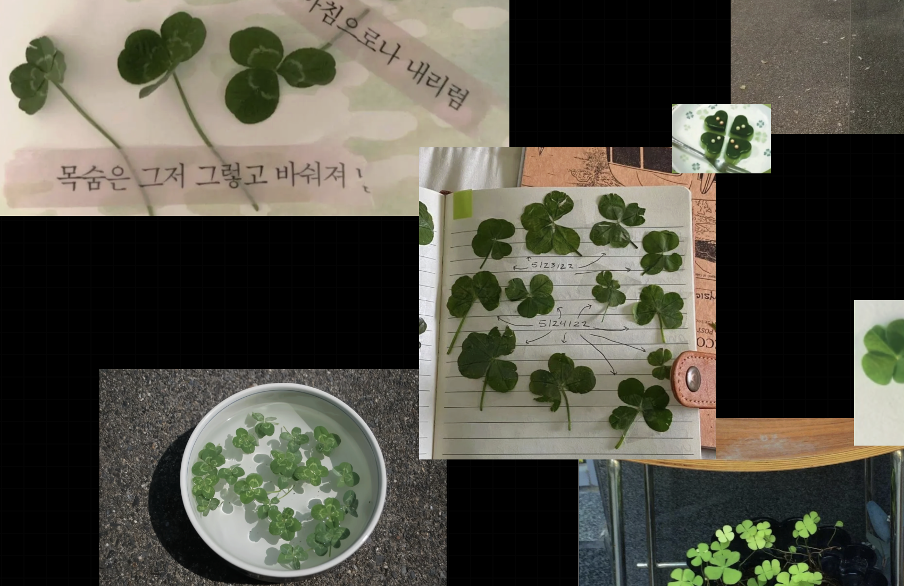
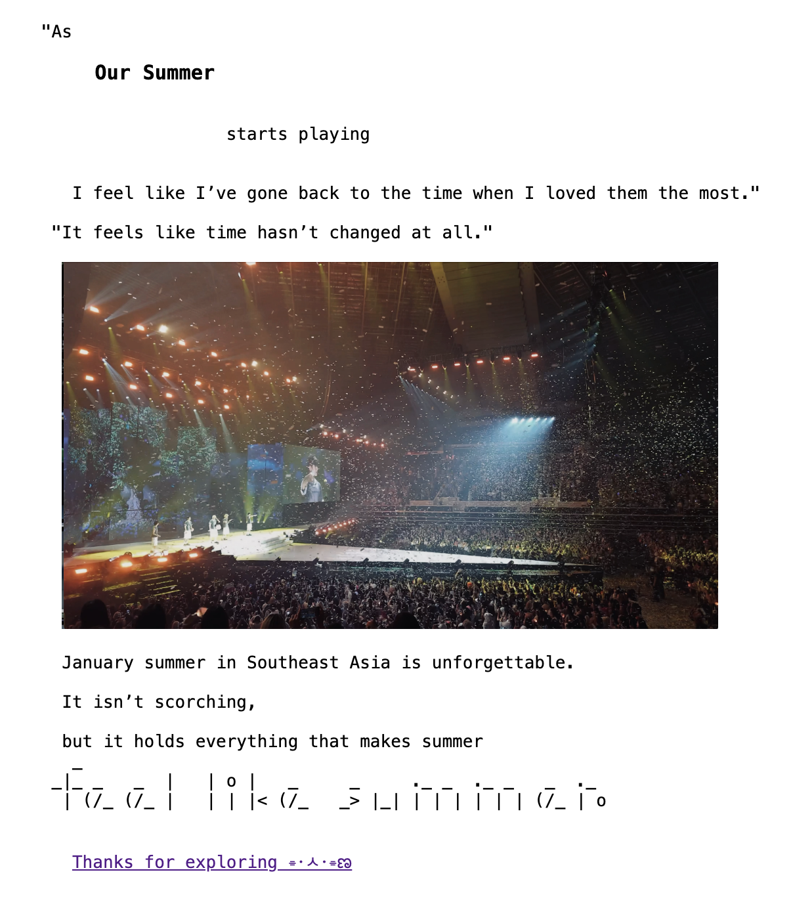
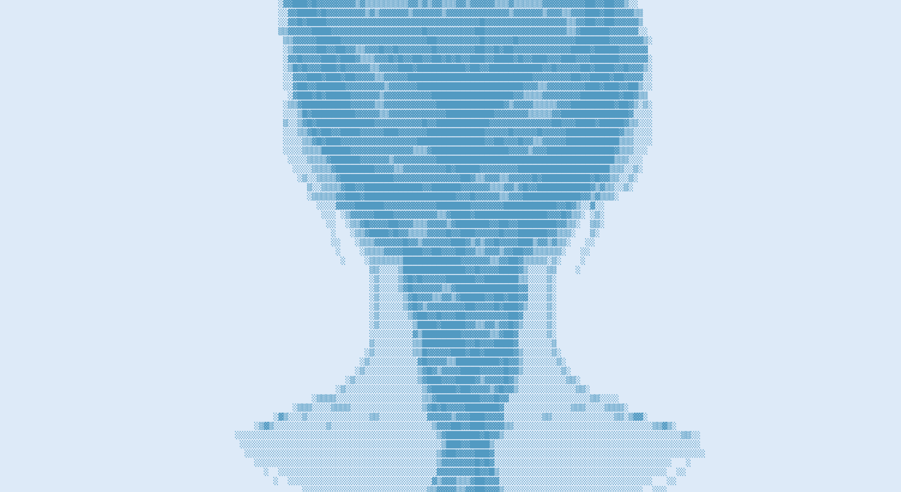
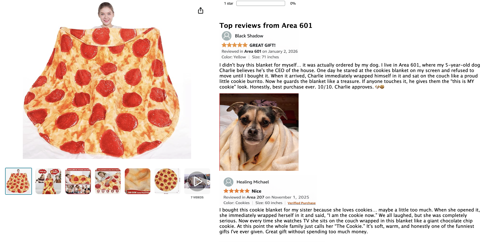
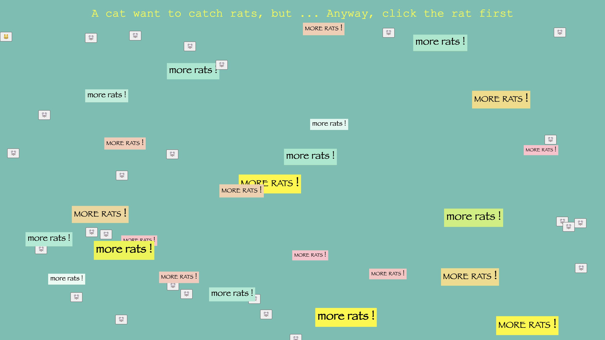
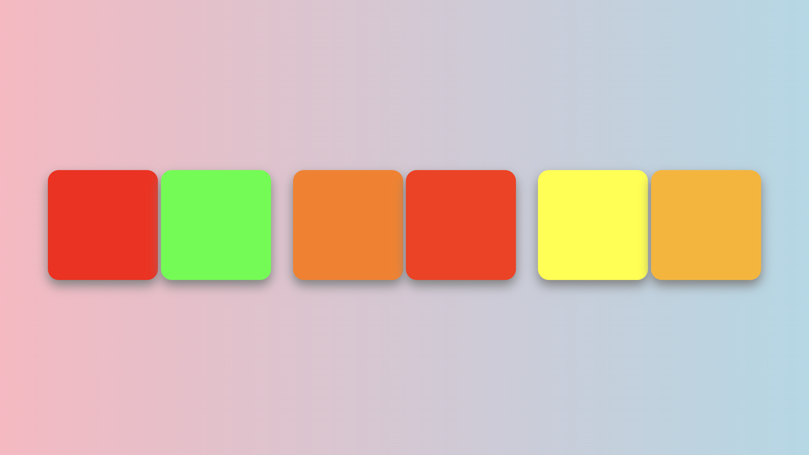
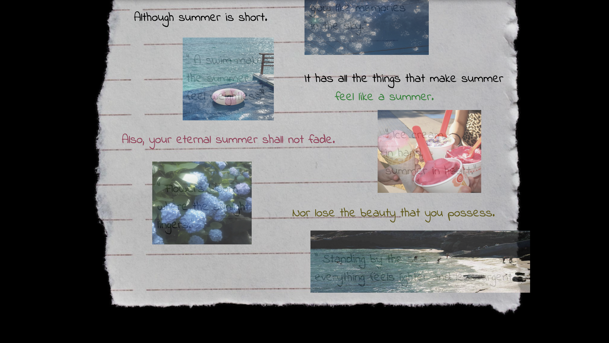
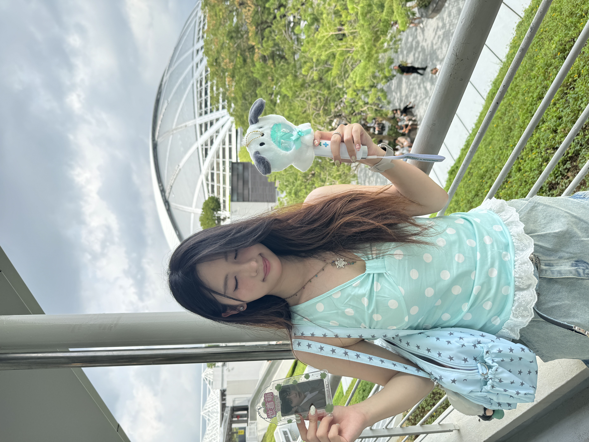

# This is Lisa's Commlab Page 

The live link to my repo is: [https://github.com/lo2272-hub/Communication-Lab](https://github.com/lo2272-hub/Communication-Lab)

## Here you can find my project 

I made them all during Spring 2026 (๑╹ω╹๑ )

I mainly learn html and css right now. But I'm looking forward to exploring more in the future ദ്ദി(｡•̀ ᗜ<)

- [Journey to spreadsheet](https://docs.google.com/spreadsheets/d/1LdQYsOHNv-1dBA1zyZRBTqEB-8OQJGE30Q6ba7zpSw0/edit?usp=sharing)

- [Life Scroll](https://lo2272-hub.github.io/Communication-Lab/Recitation)

- [Tutorial on the Web ](https://lo2272-hub.github.io/Communication-Lab/tutorial/)

- [Shanzhai Website](https://lo2272-hub.github.io/Communication-Lab/Project1)

- [A Cat and Rats](https://lo2272-hub.github.io/Communication-Lab/Recitation9/)

- [Clock](https://lo2272-hub.github.io/Communication-Lab/Recitation11/)

- [Shall I Compare You to a Summer's Day](https://lo2272-hub.github.io/Communication-Lab/Project2/)

Below is me  ૮꒰ ྀི˶• ๑ •˶ ྀི꒱ა

